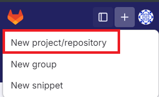

# MINI PROJET GITLAB

Ce mini projet est dans le cadre du bootcamp Devops de Eazytraing

**Nom** : AUGET

**Prénom** : Rabina

**Pour la promotion 19 du Bootcamp DevOps**

**Période** : Mai - Juin - Juillet 2024

**Date de réalisation**: 15 Juin 2024

**LinkedIn** : www.linkedin.com/in/auget-rabina-61663314a

# Contexte du projet

Ce projet a pour objectif de mettre en place un pipeline CI/CD (Intégration Continue et Déploiement Continu) afin d'automatiser le processus de livraison et de déploiement d'une application. 

Le pipeline sera déclenché à chaque push de code dans le repo GitLab, garantissant ainsi, que les nouvelles modifications sont automatiquement construits (phase de build), testées, intégrées et déployées sur les serveurs de Test (Staging) et de Production.

# Fonctionnement du pipeline

Le pipeline CI/CD sera structuré en plusieurs étapes clés:

1. **La phase de Build :** consistera à la compilation du code source et construction des artefacts nécessaires pour le déploiement.

2. **La phase de Test de l'artifact (Test d'acceptance) :** sera la partie où nous allons tester et confirmer que l'artifact précédement créée est bien fonctionnel.

3. **La phase de sauvegarde de l'image (Release image) :** Après avoir confirmer que l'artéfact est bien fonctionnel, nous allons le sauvegarder afin de pouvoir le déployer sur les serveurs tests/prod ou le réutiliser ultérieurement.

4. **La phase de déploiement sur le serveur Test (Staging) :** sera la partie où nous allons effectuer le déploiement sur le serveur test. Cela va permettre de tester l'application par exemple.

5. **La phase de révision (Deploy Review) :** L'application, après avoir été testée et validée, doit être déployée en production. Mais avant cela, elle passera par une phase de révision pour s'assurer qu'elle fonctionne correctement et sans erreurs.

6. **La phase de déploimeent sur le serveur Prod :** L'application, ayant été confirmée comme fonctionnelle à toutes les étapes, peut maintenant être déployée sur l'environnement de production pour être utilisée par les clients.

# Application: 

Donc le pipeline sera composé de:

+ **Le dossier webapp :** va contenir les fichiers du code source de l'application.
+ **Le fichier .gitlab-ci.yml :** où nous allons décrire toutes les étapes du pipeline CI/CD.
+ **Le fichier Dockerfile :** nous servira à créer l'image docker de notre application pour pouvoir le conteneuriser.

# Infrastructure:

Nous allons utiliser les technologies ci-dessous:

+ **Physical host :** Windows 11
+ **Gitlab :** Nous allons utiliser le gitlab public, accessible sur https://gitlab.com/
+ **Runner :** Et pour le runner, nous allons utiliser les runners de Gitlab car Gitlab fourni déjà toutes sortes de runners. Pour ce projet, nous allons utiliser Docker DinD (Docker in Docker)
+ **Heroku :** Et pour déployer notre application, nous allons le déployer sur Heroku qui est une plateforme de déploiement d'application (https://www.heroku.com/)

# Préparation de l'environnement:

1. Pour commencer, nous allons créer un projet/repository sur Gitlab avec le +:

2. Nous allons maintenant être rediriger vers l'interface de création du nouveau projet. On aura plusieurs choix, mais étant donné que j'ai déjà téléchargé le code source sur mon ordinateur local depuis GitHub car j'ai voulu organiser mes fichiers, je vais créer un nouveau projet vièrge.

3. Il faut maintenant spécifier le nom du projet et mettre le projet en public. Pour les autre options qui sont optionnelles, je vais les laisser comme tels et je clique sur `Create project`.

4. Une fois le projet créée, nous allons copier le lien du repo via le bouton en bleu `Code` et choisir la méthode `Clone with HTTPS` en cliquant sur l'icône presse papier à côté de l'URL.

5. Et sur mon ordinateur local, je vais naviguer vers le répertoire où j'ai mis le project. 

    + Ensuite, ajouter le repo gitlab que je viens de créer comme repo distant et son nom d'identification sera `origin` : 
    
    `git remote add origin https://gitlab.com/skynet17/mini-projet-gitlab.git`

    + Puis, renommer la branche par défaut où je me trouve actuellement en `main`: `git branch -M main`
    + Enfin, il est temps de pousser les fichiers du code sources vers le repo distant `origin` et sous la branche `main`: `git push -uf origin main`

6. J'ai terminé de créer le fichier `Dockerfile` et `.gitlab-ci.yml` sur mon ordinateur local donc je vais maintenant pouvoir les pousser vers Gitlab sous la branche main comme suit:

    + `git add .`
    + `git commit -m "First commit"`
    + `git push origin main`

# Phase de build: 

1. Après avoir terminer le push des fichiers, on peut remarquer cet icône qui nous indique qu'un pipeline est en cours d'execution.

2. Si on patiente un peu, cet icône va passer en vert pour nous indiquer que le pipeline s'est bien déroulé avec succès. Mais on peut aussi aller dans la barre latérale gauche dans `Build` > `Pipeline`. C'est là que nous pourrions voir la liste de tous les pipelines d'un projet. Et on peut voir également que le pipeline de build s'est lancé automatiquement après le push de notre code.  Mais comme notre fichier `.gitlab-ci.yml`ne contient pour l'instant que la partie `build`, il n'y a pour l'instant qu'un seul job sur la partie `Stages`. On peut cliquer sur le statut du job pour voir exactement la partie du stage qui est en cours d'execution qui est le `docker-build`.

4. On peut maintenant cliquer sur `docker-build`pour voir la console du job qui nous montre tous les étapes du build: Depuis la génération du container Dind jusqu'au status finale du Job qui est ici `succeeded`qui nous indique le job s'est terminé sans erreur.

5. Sur GitLab, chaque job crée un conteneur qui est supprimé une fois le job terminé. C'est pourquoi, dans notre fichier de pipeline `.gitlab-ci.yml`, nous sauvegardons l'image Docker en tant qu'artifact pour qu'elle soit disponible pour les jobs suivants. On peut vérifier que l'artifact a bien été sauvegardé dans `Build` > `Artifact` et la référence du commit de l'artfifact correspond bien à la référence du commit de notre pipeline `2ef8da8b`

6. Si on regarder le contenu de l'artifact, il contient 3 fichiers 
   + `artifacts.zip` : qui contient l'image docker .tar
   + `metadata.gz` : les metadonnés de l'artifact: nom de l'image, le droit du système sur le fichier, le crc pour la sécurité du fichier, la taille de l'image
   + `job.log`: les logs du pipeline que nous avons vu sur la partie 4.

Donc maintenant, nous pouvons passer à la phase de test d'acceptation.

# Phase d'acceptant : 

